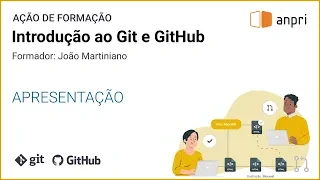

# Hello :wave: I'm João Martiniano

[](https://www.linkedin.com/in/joaomartiniano/) [
](https://www.youtube.com/@jmartiniano)

**PT**
- Professor de informática na [Escola Secundária Avelar Brotero](https://github.com/escolabrotero)
- Formador de professores
- Criador de conteúdos digitais

**EN**
- *High school computer science teacher at* [Escola Secundária Avelar Brotero](https://github.com/escolabrotero)
- *Teacher trainer*
- *Digital content creator*

## Algum do meu trabalho / *some of my work*

A maioria do meu trabalho prende-se com educação e a formação de professores. Também crio repositórios para projetos pessoais ou relacionados com tecnologias que vou explorando.

*Most of my work is related to education and teacher training. I also create repositories for personal projects or related to technologies that I'm exploring.*

### Repositórios de âmbito educativo / *repositories used in teaching*

- [Desafio de programação Páscoa 2024](https://joaomartiniano.github.io/desafio-programacao-pascoa-2024/): Simulação em C# de uma bola em movimento na consola
- [Arrays1](https://github.com/joaomartiniano/Arrays1), [Arrays2](https://github.com/joaomartiniano/Arrays2), [Arrays3](https://github.com/joaomartiniano/Arrays3): Exercícios sobre arrays na linguagem C#, devendo os alunos completar o código em falta
- [Exemplo de criação de uma exceção](https://github.com/joaomartiniano/exemplo-criar-excecao): Exemplifica a criação de uma exceção na linguagem C# 
- [Paginação em PHP](https://github.com/joaomartiniano/paginacao-php): Demonstração de paginação em PHP
- [Aplicação "Clínica Médica de Coimbra"](https://github.com/joaomartiniano/clinica-medica-coimbra): Aplicação C# que simula uma clínica médica, para utilização em contexto de ensino 
- [Acesso Programático a Bases de Dados: MySQL/MariaDB e C#](https://github.com/joaomartiniano/DemoBaseDados): Conjunto de projetos na linguagem C# que demonstram como utilizar uma base de dados MySQL/MariaDB.
- [Notepad](https://github.com/joaomartiniano/Notepad): Clone da aplicação Bloco de Notas do Windows, desenvolvido para auxiliar a lecionação da linguagem C#
- [Galeria Arte & Artes](https://github.com/joaomartiniano/arte-e-artes): Website fictício de uma galeria de arte, para aprendizagem da tecnologia ASP.NET Web Pages

### Projetos pessoais / *personal projects*

- [Minibug](https://github.com/joaomartiniano/MiniBug): Aplicação criada para gerir listas de bugs e listas de tarefas durante o desenvolvimento de aplicações
- [Recursos digitais multimédia](https://github.com/joaomartiniano/recursos-digitais): Lista  de vários tipos de recursos digitais gratuitos ou de utilização gratuita
- [Snowflakes on canvas](https://github.com/joaomartiniano/snowflakes-on-canvas): Efeito de neve a cair, utilizando o elemento HTML ```<canvas>``` e JavaScript
- [UnicodeViewer](https://github.com/joaomartiniano/UnicodeViewer): Aplicação escrita em C# para visualização de caracteres Unicode
- [CSS transforms](https://github.com/joaomartiniano/css-transforms): Código HTML utilizado num vídeo introdutório sobre CSS transforms

### YouTube

**[Introdução ao Git e GitHub](https://www.youtube.com/playlist?list=PLxG9jJiiFxh1_pdhTiPWv2ONvsLfxWEtU)**
Curso de formação composto por 13 vídeos e que fornece uma introdução ao controle de versões utilizando o software Git e GitHub Desktop, bem como a plataforma GitHub

[](https://www.youtube.com/playlist?list=PLxG9jJiiFxh1_pdhTiPWv2ONvsLfxWEtU)